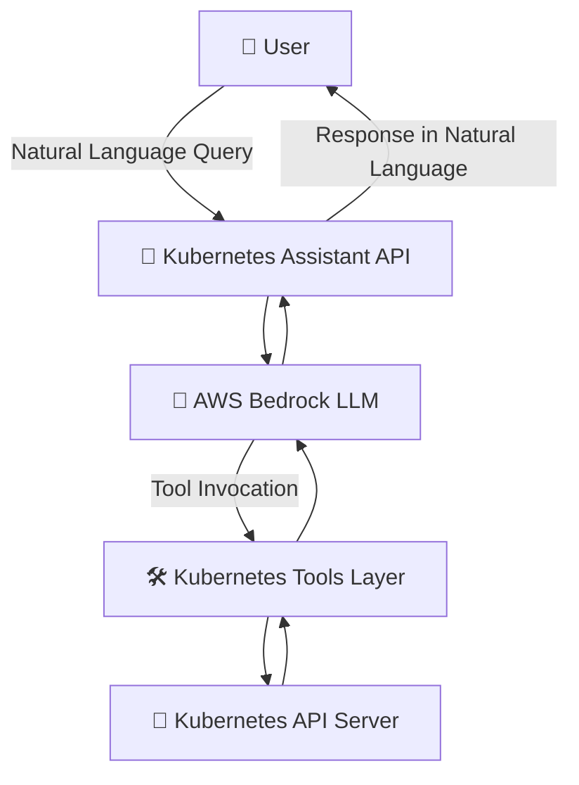

Perfect 👍 You’re essentially building a **Kubernetes AI Assistant powered by AWS Bedrock**. Here’s a **well-structured `README.md`** that includes project description, workflow architecture, setup instructions, and the note about AWS credentials being passed as Kubernetes secrets.

---

# 🧑‍💻 Kubernetes AI Assistant

A **Kubernetes Assistant** powered by **AWS Bedrock (Claude 3 Haiku)** that can answer natural language queries about your Kubernetes cluster.
It provides **read-only insights** into Pods, Deployments, Logs, and Namespaces using a set of LangChain tools.

⚡ This project helps developers and SREs interact with Kubernetes in plain English instead of writing `kubectl` commands.

---

## 🚀 Features

* 🔹 Query Kubernetes resources in natural language (Pods, Deployments, Namespaces, Logs).
* 🔹 Uses **AWS Bedrock LLMs** for conversational intelligence.
* 🔹 Securely connects to Kubernetes API **in-cluster** using ServiceAccount.
* 🔹 **Read-only by design** (cannot delete/modify resources).
* 🔹 Modular and extensible tool system (`core/tools.py`).

---

## 🏗️ Architecture Workflow



**Key Components:**

* **LangChain Tools (`core/tools.py`)** → Functions to list pods, get details, fetch logs, etc.
* **LangChain Agent (`core/agent.py`)** → Uses Bedrock LLM to decide which tool to call.
* **ServiceAccount + RBAC** → Ensures secure read-only access to Kubernetes API.
* **Secrets** → AWS credentials are stored as Kubernetes secrets and mounted as environment variables.

---

## ⚙️ Prerequisites

* A Kubernetes cluster (can be self-managed on EC2, not only EKS).
* kubectl installed & configured.
* AWS credentials with access to **Bedrock**.
* Docker (if you want to build your own image).

---

## 🔑 AWS Credentials

You must create a Kubernetes Secret with your **AWS Access Key** and **Secret Key**:

```bash
kubectl create secret generic aws-credentials \
  --from-literal=AWS_ACCESS_KEY_ID=YOUR_ACCESS_KEY \
  --from-literal=AWS_SECRET_ACCESS_KEY=YOUR_SECRET_KEY
```

This secret will be mounted as environment variables inside the Pod.

---


---

## 🖥️ Usage

Once deployed, you can:

* Port-forward to access locally:

  ```bash
  kubectl port-forward svc/k8s-assistant-service 8000:8000
  ```
* Query the assistant (via API or frontend if added).

**Example Queries:**


* *“Show me the deployments in namespace default”*
* *“Get logs from pod my-app-1234”*

---

## 🔒 Security

* The assistant is **read-only** (cannot delete or modify).
* Uses **ServiceAccount + RBAC** for restricted access.
* AWS credentials are stored as **Kubernetes secrets**.

---


## 📚 Tech Stack

* **Python**
* **LangChain + LangGraph**
* **AWS Bedrock (Claude 3 Haiku)**
* **Kubernetes Python Client**
* **Kubernetes (RBAC, Secrets, ServiceAccounts)**

---

## ✅ Limitations

* Only supports **read-only operations**.
* Dependent on AWS Bedrock access.
* Currently supports **Pods, Deployments, Logs, Namespaces** only.


